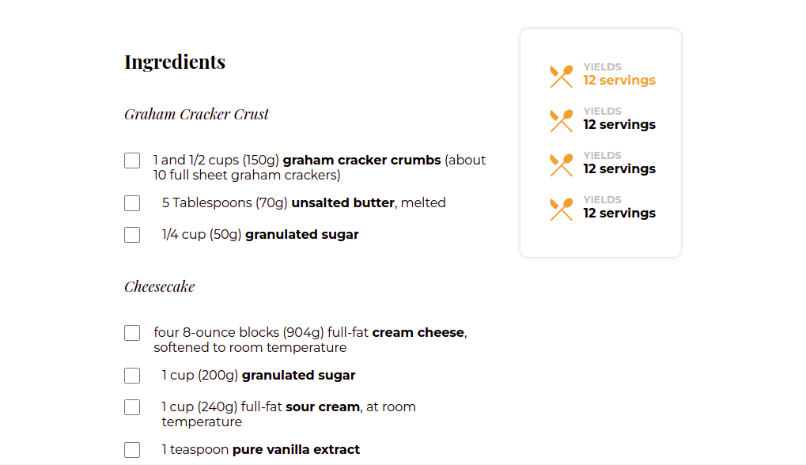

# Recipe page
This repo contains the solution the challenge from the [Devchallenges.io](https://devchallenges.io/paths/responsive-web-developer) in the Responsive Developer track.

[Live link : Click Here](https://masterpranay1.github.io/recipe-page)

## Features
- Responive
- Nice Project for Practice Flexbox
- Styles input, images
- Manges Different Font Familes

## Built With
- HTML5
- SCSS

## Screeshots

- Desktop

- Mobile

## Author 
- Linkedin : [@masterpranay](https://www.linkedin.com/in/masterpranay/)